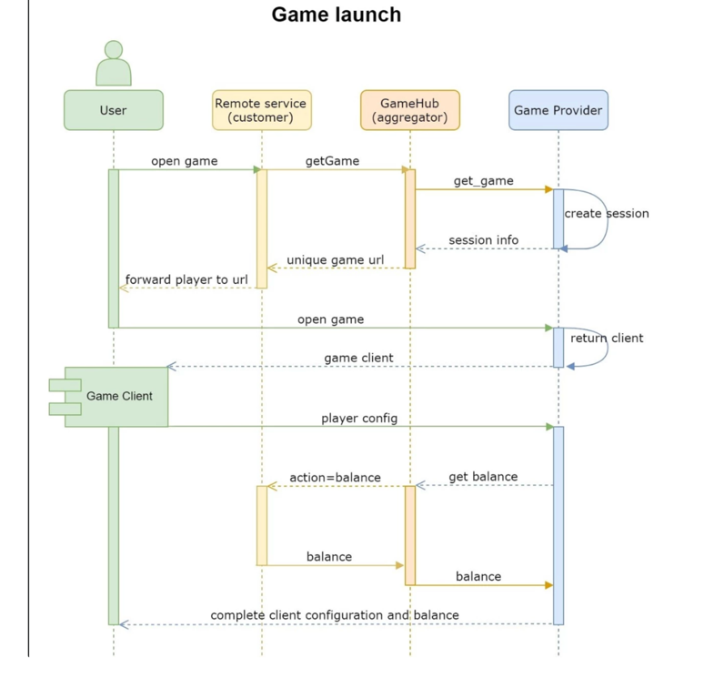
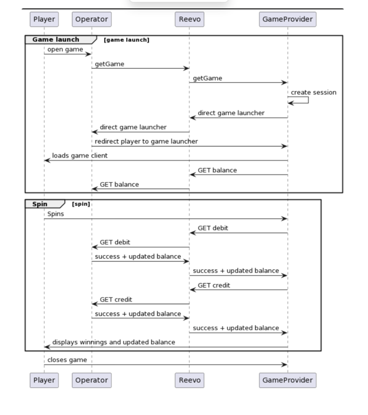
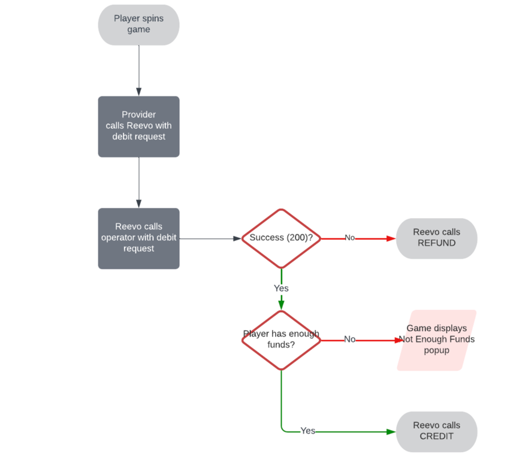
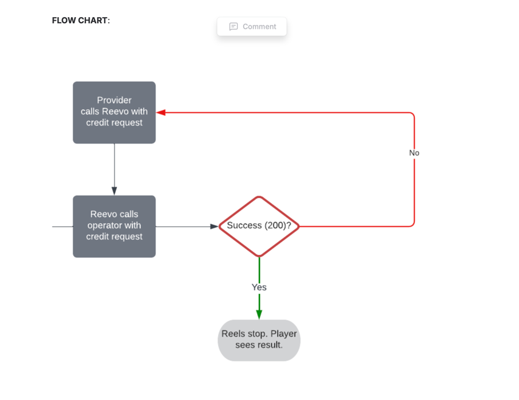
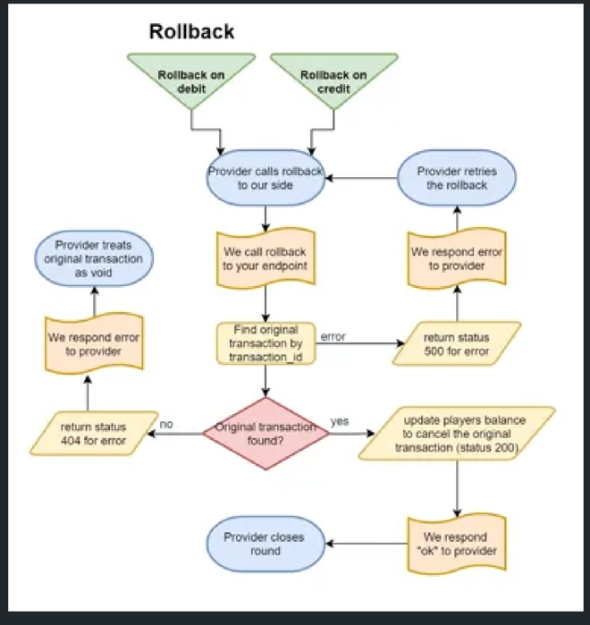
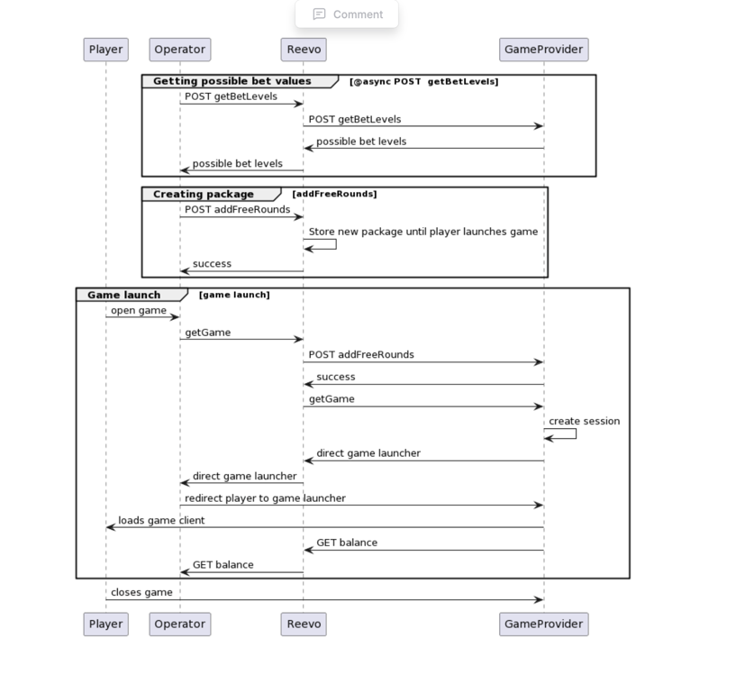

1) Game List: POST getGameList


By Lily Zagray (Unlicensed)


2 min

Add a reaction
Retrieves the games enabled for your operator.


This should not be called more than a few times per day. We will actively monitor activity on this endpoint as it can return a very big amount of data.

REQUEST
Parameter
Type
Description
api_login
String
Mandatory. Value given to you during configuration.
api_password
String
Mandatory. Value given to you during configuration.
method
String
Mandatory. Always "getGameList"
show_systems
Integer (0|1)
Optional. Default 0. Whether or not the provider name information should be returned for each game.
currency
String
Main currency for the operator.

provider_type - providerisb | providerbog


curl --request POST
--url https://{{REEVO_ENDPOINT}}/api/seamless/{provider_type} \
--header 'Content-Type: application/json' \
--data '{
"api_password" : "xapitest",
"api_login" : "xapitest",
"method" : "getGameList",
"show_systems" : 0,
"currency" : "EUR"
}'


ERROR RESPONSE

Our API will always respond with 200 http code even in case of error. In this case the parameter ‘error’ will be set to 1 and accompanied by a description of the problem.


{
"error":1,
"message":"Unknown api user unknown_operator_mc_s"
}


SUCCESSFUL RESPONSE

Parameter
Type
Description
id
String
Primary Reevo platform game id to be used in getGame requests. Will be sent by the platform with every in-game transaction.
skinid
String
Game’s skin id. Used only if launching games via isblauncher.
Not required for any new integrations.
id_hash
String
Secondary Reevo platform game id. Can be ignored or used for validation during in-game transactions.
name
String
Game name.
type
String
Game type: video-slots, video-poker, ...
category
String
Game category.
Deprecated, for most providers it will just have the provider name.
subcategory
String
Game category.
Deprecated, for most providers it will just have the provider name.
provider
String
Game provider code.
Optional. Will only be returned if requested with show_systems.
provider_name
String
Game provider name.
Optional. Will only be returned if requested with show_systems.
freerounds_supported
Boolean
Specifies if game supports activation of free rounds via 'addFreeRounds' method.
has_jackpot
Boolean
Specifies if game has pool jackpots.
play_for_fun_supported
Boolean
Specifies if game supports FUN mode.
mobile
Boolean
Specifies if this game is mobile only.
multi_device
Boolean
Specifies if this game supports both desktop and mobile with the same id.
rtp
String
Game RTP.
details
String
Contains any extra game information. Does not conform to any specific format.
image
String
URL to game thumbnail.
image_preview
String
URL to game screenshot.
image_background
String
URL to game background image.
image_filled
String
URL to game image without transparencies.


{
"error":0,
"currency":"USD"
"response":[
{
"id": "918819",
"skinid": "54657",
"name": "Treasures God",
"id_hash": "rl_rl-treasures-god",
"type": "slots",
"category": "Reevo Premium",
"subcategory": "_Reevo_Premium",
"provider": "rl",
"provider_name": "Reevo Premium",
"freerounds_supported": true,
"has_jackpot": false,
"play_for_fun_supported": true,
"mobile": false,
"multi_device": false,
"rtp": "95.69",
"details": "{\"lines\":\"25\",\"reels\":\"5\",\"freespins\":\"yes\",\"bonusgame\":\"yes\"}",
"image": "https://stage-aggr.reevotech.com/media/images/slots/small/rl/rl-treasures-god.png",
"image_preview": "https://stage-aggr.reevotech.com/media/images/popup/rl-treasures-god.jpg",
"image_filled": "https://stage-aggr.reevotech.com/media/images/slots/small/rl/jpg/rl-treasures-god.jpg",
"image_background": "https://stage-aggr.reevotech.com/media/images/backgrounds/rl/rl-treasures-god.jpg"
},
...
],
}


2) Game Launch: POST getGame


By Lily Zagray (Unlicensed)


1 min

Add a reaction
This API call can be used to retrieve the launcher URL to start a game.
Info
method POST https://{{REEVO_ENDPOINT}}/api/seamless/providerbog
REQUEST
Parameter
Type
Description
api_login
String
Mandatory. Value given to you during configuration.
api_password
String
Mandatory. Value given to you during configuration.
method
String
Mandatory. Always "getGame"
currency
String
Mandatory. Player currency.
lang
String
Mandatory. Game language.
gameid
integer
Mandatory. Id of the game (as received in getGameList->id)
play_for_fun
Boolean
Mandatory. True to launch the game in FUN mode, false to launch it in REAL mode.
gamesession_id
String
Mandatory. Id that identifies the current game session. Should be unique on every single game launch.
sessionid
String
Mandatory. Id that identifies the player’s session in the lobby (can be the same across multiple game sessions).
homeurl
String
Optional. Should contain the URL the player will be sent to when clicking the game’s exit button.
cashierurl
String
Optional. URL to be used to launch a cashier where the player can deposit more funds.
user_username
String
Mandatory. Player’s username. Main parameter used to identify the player across all API communication.
user_password
String
Mandatory. Player token or any other parameter that can be used for basic validation of requests.
channel
String
Optional. Possible values: mobile, desktop.

If not provided the aggregation platform will attempt to detect the player’s device via user agent.
sub_operator
String
Optional. If many brands are running through the same configuration, please share via this parameter the name of each.
type = (providerisb ||providerbog)


curl --request POST
--url https://{{REEVO_ENDPOINT}}/api/seamless/{type} \
--header 'Content-Type: application/json' \
--data '{
"api_login": "...",
"api_password": "...",
"method": "getGame",
"currency": "USD",
"lang": "en",
"gameid": 5019,
"play_for_fun": false,
"sessionid": "this-identifies-the-casino-session",
"gamesession_id": "this-identifies-the-game-sesion",
"user_username": "sample_username",
"user_password": "sample_token",
"homeurl": "https:\/\/uat.casinoexpresso.com",
"cashierurl": "https:\/\/uat.casinoexpresso.com\/cashier",
"channel": "desktop"
}'


ERROR RESPONSE

Our API will always respond with 200 http code even in case of error. In this case the parameter ‘error’ will be set to 1 and accompanied by a description of the problem.


{
"error":1,
"message":"Unknown api user unknown_operator_mc_s"
}


SUCCESSFUL RESPONSE


{
"error": 0,
"response": "https://www.game-program.com/casino/frontend/EmbeddedGame/EmbeddedGame.swf?gameId=99&gameSWF=thePiramid.swf&sessionHash=test ",
"gamesession_id": "gs9834ndasd",
"sessionid": "123-898sdjkaERRA"
}





The seamless API calls are made by Reevo to your operator’s servers and are the main communication of player transactions and balance throughout gameplay.

They happen after a successful game launch (which should have happened via getGame).





There are four seamless calls. They are all sent as a GET request to your servers, following the same format.


curl <WALLET_ENDPOINT>/?action=balance&callerId=test&callerPassword=12dar67890123&remote_id=1&session_id=12345678901234567890 1324567980abcd&key=38432ff064690c9b03da519d0c685b104545 1c9e&new_parameter=12345&gamesession_id=98erf743arka&game_id_hash=gs_gs-texas-rangers-reward

balance - Used once at game launch and then throughout the game whenever the game requires an updated balance to show in the UI. Should not affect player balance, just retrieve it.
debit - Usually happens at the start of a spin. This call should (with some exceptions) remove money from the player’s balance in order to pay for the spin.
credit - Call that communicates any winnings that happened throughout a game session.
rollback - API call used to cancel and completely roll back a transaction that was made previously but that for whatever reason is no longer valid.
Request validation


Each request is escorted with a query param key with a value of a sha1 cached query string and a salt key provided by our integrations team at the start of the integration process.
Example: action=balance&remote_id=123&session_id=123- abc&key=38432ff064690c9b03da519d0c685b1045451c9e).
The query param key value must match sha1([SALT KEY]+[QUERY STRING]


```
Query string example: action=balance&remote_id=123&session_id=123-abc
PHP code quick example:


$data = $_GET;
$key = $data['key'];
unset($data['key']);
$hash = sha1($salt.http_build_query($data));
 
 
Then check if $key == $hash….

```


This API call is made at game launch and at any other occasions in which the game requires an updated balnace to display in the game UI.

Important info

We recommended you to do not do any checks on balance requests or keep them to very minimal (salt check is required) since balance requests can come without session or game_id in some cases (provider asks for balance before creating session).

REQUEST

Common parameters (used on all seamless calls):
Query string name
type (max)
description
mandatory
callerId
String
Caller authentication username
Y
callerPassword
String
Caller authentication password - sha1 encoded
Y
callerPrefix
String
2 or more letter prefix that is used internally to prefix player username for your account
N
username
String
Player username (non-prefixed) created by your getGame call
Y
action
String
External service action [balance, debit, credit]
Y
Query string name
type (max)
description
mandatory
remote_id
integer(10)
Unique player id
Y
game_id
string (32 - 40)
Unique game id, see action getGameList
N
session_id
string (32 - 40)
Unique game session id generated by gamehub
Y
key
string (40)
Request validation cache key
Y
gamesession_id
string (255)
Enable tracking the player game sessions
N
game_id_hash
string (100)
Related to introduction of id_hash from getGameList method, can be used the same way as currently is game_id used
N
is_init
boolean
If this is true, it is the first request in a new game session and you can start on your side.
Y
No data to display
We can’t find this chart’s source table on the page.
u


curl <WALLET_ENDPOINT>/?action=balance&callerId=test&callerPassword=12dar67890123&remote_id=1&session_id=12345678901234567890 1324567980abcd&key=38432ff064690c9b03da519d0c685b104545 1c9e&new_parameter=12345&gamesession_id=98erf743arka&game_id_hash=gs_gs-texas-rangers-reward&is_init=true


RESPONSE

JSON key
type (max)
description
mandatory
status
integer(3)
HTTP status code
Y. The wallet can respond with 200 for success or 500 service error.
balance
double(10,2)
Players balance (after transaction)
Y
msg
string(255)
Error message
N
Example:


{"status":"200","balance":"300.00"}


{"status":"500","msg":"internal error"}


debit requests are sent whenever a players should have money removed out of his account to pay for the next spin or other in-game functionalities.
REQUEST
Query string name
type (max)
description
mandatory
callerId
String
Caller authentication username
Y
callerPassword
String
Caller authentication password - sha1 encoded
Y
callerPrefix
String
2 or more letter prefix that is used internally to prefix player username for your account
N
username
String
Player username as provided by you on getGame
Y
Query string name
type (max)
description
mandatory
action
string
External service action [balance, debit, credit]
Y
remote_id
integer(10)
Unique player id
Y
amount
double(10,2)
Amount to debit from players account
Y
currency
string(3-5)
Player currency.
Y
provider
string(2)
Game provider
Y
game_id
string (32 - 40)
Unique game id, see action available_games
Y
transaction_id
string(32-70)
Unique transaction id for current transaction. For online table games transaction id is only unique per player.
Y
gameplay_final
integer(1)
It tells you if the round is finished(1..finished, 0..unfinished)
Y
round_id
string(32-70)
Game round id for current running game round
Y
session_id
string (32 - 40)
Unique game session id generated by gamehub
Y
key
string(40)
Request validation cache key
Y
gamesession_id
string (255)
Enable tracking the player game sessions, if player has multiple sessions open we use session from the last launched game
Y
game_id_hash
string (100)
Related to introduction of id_hash from getGameList method, can be used the same way as currently is game_id used
N
fee
double(10,2)
Fees related to this transction. Only used in tournament hub.
N
tip_in_amount
double(10,2)
Player left a tip for the dealer - it is already included in amount field. Only used in Ezugi livecasino.
N
is_freeround_bet
boolean
This bet came from freerounds (usualy amount will be 0)
N
freeround_id
string(100)
ID of the freerounds. It should be the same as "freeround_id" paramater in AddFreerounds response
N
odd_factor
double(10,2)
odd factor - only used in sportsbooks
N
jackpot_contribution_in_amount
double(10,6)
Amount of bet that is contributed to the jackpot contribution. Already included in bet.
N
jackpot_contribution_ids
array of alphanumeric ids
Ids' of the jackpots this bet is contributing to - deprecated
N
jackpot_contribution_per_id
array of doubles
Contributions per different jackpot types, in same order as above contribution_ids. - deprecated
N


curl <WALLET_ENDPOINT>/?action=debit&callerId=test&callerPassword=12dar67890123&remote_id=1&amount=0.3&game_id=3 &transaction_id=27&round_id=123&session_id=123456789012 345678901324567980abcd &key=49f749364b129d9f91d2bef7dd044a93af0fb676&new_parameter=12345&gamesession_id=98erf743arka&game_id_hash=gs_gs-texas-rangers-reward


RESPONSE
JSON key
type (max)
description
mandatory
status
integer(3)
HTTP status code
Y
Balance
double(10,2)
Players balance (after transaction)
Y
msg
string(255)
Error message
N
transaction_id
string(8 - 64)
Transaction id
N
Status codes
External service can respond with 3 possible status codes;
200 - success
403 - Transaction refused. Insufficient funds. The game will stop. Rollback will not be triggered.
500 - Service error. The game will stop after some retries after which a rollback will be sent.


{"status":"200","balance":"300.00"}

{"status":"403","balance":"0.30","msg":"Insufficient funds"}

{"status":"500","msg":"internal error"}

FLOW CHART:



Credit


This API will be called whenever a player should have funds deposited to his account, usually as a result of a spin or any special event.
On a losing spin, this method is still called, with amount 0.
Multiple credit requests can happen for a single corresponding debig request, e.g. during in-game freespins.

REQUEST

Query string name
type (max)
description
mandatory
callerId
String
Caller authentication username
Y
callerPassword
String
Caller authentication password
Y
callerPrefix
String
2 or more letter prefix that is used internally to prefix player username for your account
N
username
String
Player username as provided by you on getGame
Y
Query string name
type (max)
description
mandatory
action
String
Type of action [credit]
Y
remote_id
integer(10)
Unique player id
Y
amount
double(10,2)
Amount to credit to players account
Y
currency
string(3-5)
Player currency.
Y
provider
string (2)
Game provider
Y
game_id
string (32 - 40)
Unique game id, see action available_games
Y
transaction_id
string(32- 70)
Unique transaction id for current transaction
Y
gameplay_final
Integer(1)
It tells you if the round is finished(1 - finished, 0 - unfished)
Y
round_id
string (32 - 70)
Game round id for current running game round
Y
session_id
string (32 - 40)
Unique game session id generated by gamehub
Y
key
string(40)
Request validation cache key
Y
gamesession_id
string (255)
Enable tracking the player game sessions, if player has multiple sessions open we use session from the last launched game
Y
game_id_hash
string (100)
Related to introduction of id_hash from getGameList method, can be used the same way as currently is game_id used
N
is_freeround_win
Integer (1/0)
This win came from freerounds if 1, else 0
N
freeround_id
string(100)
ID of the freerounds. It should be the same as "freeround_id" paramater in AddFreerounds response
N
freeround_spins_remaining
integer(3)
Number of freeround spins remaining. Currently not available for all providers
N
freeround_completed
Integer (1/0)
Freerounds completed if 1, else 0
N
is_jackpot_win
Integer (1/0)
This is a jackpot win if 1, else 0
N
jackpot_win_ids
array of alphanumeric ids
Ids' of the jackpots this win belongs to. - deprecated
N
jackpot_win_in_amount
double(10,2)
Jackpot amount won - already included in the amount property.
N


curl <WALLET_ENDPOINT>/?action=credit&callerId=test&callerPassword=12dar67890123&remote_id=1&amount=0.3&game_id=3&transaction _id=27&round_id=123&session_id=12345678901 2345678901324567980abcd &key=49f749364b129d9f91d2bef7dd044a93af0fb676&new_parameter=12345&gamesession_id=98erf743arka&game_id_hash=gs_gs-texas-rangers-reward

RESPONSE

JSON key
type (max)
description
mandatory
status
integer(3)
HTTP status code
Y
Balance
double(10,2)
Players balance (after transaction)
Y
msg
string(255)
Error message
N
transaction_id
string(8 - 64)
transaction id
N
Status codes

External service can respond with 3 possible status codes;
200 - success
403 - Transaction refused.  The game will stop. Rollback will not be triggered. You should NOT use this response unless there’s a really good reason.
500 - Service error. The game will stop after some retries. Upon game relaunch the wins will be retried again until accepted.


{"status":"200","balance":"300.00"}

{"status":"403","balance":"0.30","msg":"Insufficient funds"}

{"status":"500","msg":"internal error"}

ADDITIONAL INFO

With round_id a win can be connected to the corresponding bet. Please be aware there can be some cases of wins without bet before them. For example, in some cases some kind of in-game award, or bonus game. It depends from provider to provider. If this is an issue for your system do let us know during configuration so that we decide how to handle it.


 

Rollback

This method is used upon a debit failure with unknown reasons (for example, insufficient funds won’t trigger it, but a 500 will). Its purpose is to return funds to the player balance if the debit had been processed by the wallet.

If the bet is not found or no money was removed from the player to begin with, nothing should be returned to the player. 

REQUEST
Query string name
type (max)
description
mandatory
callerId
String
Caller authentication username
Y
callerPassword
String
Caller authentication password
Y
callerPrefix
String
2 or more letter prefix that is used internally to prefix player username for your account
N
username
String
Player username as provided by you on getGame
Y
Query string name
type (max)
description
mandatory
action
string
External service action [balance, debit, credit, rollback]
Y
remote_id
integer(10)
Unique player id
Y
game_id
string (32 - 40)
Unique game id, see action available_games
N
transaction_id
string (32 - 70)
Id of transaction that is going to be rollbacked. This will not be a new trasnsaction id, but the same as the one from the debig call.
Y
round_id
string (32 - 70)
Game round id for current running game round
N
key
string(40)
Request validation cache key
Y
game_id_hash
string (100)
Related to introduction of id_hash from getGameList method, can be used the same way as currently is game_id used
N


curl <REMOTE_WALLET>/?action=rollback&callerId=test&callerPassword=12dar67890123&remote_id=1&amount=0.3&game_id =3&transaction_id=27&round_id=123&session_id=123456789012 345678901324567980abcd &key=49f749364b129d9f91d2bef7dd044a93af0fb676&new_parameter=12345&gamesession_id=98erf743arka&game_id_hash=gs_gs-texas-rangers-reward


RESPONSE

JSON key
type (max)
description
mandatory
status
integer(3)
HTTP status code
Y
balance
double(10,2)
Players balance (after transaction)
Y
msg
string(255)
Error message
N
Status codes
External service can respond with 4 types of status codes;
200 - success
500 - service error. Our system will retry the call a few more times (up to 5). And then again manually when issue resolved.
403 - transaction refusal. No retries will be triggered.
404 - transaction not found. No retries will be triggered.


{"status":"200","balance":"300.00"}

{"status":"403","balance":"0.30","msg":"Refused"}

{"status":"404","msg":"TRANSACTION_NOT_FOUND"}

{"status":"500","msg":"internal error"}


You should rely on your internal records and refund to the player only the same amount as was taken from his account during the debit. If he was never taken any money, or only a partial debit was removed, then only that should be refunded too.

Rollback should be allowed even if the round_id is null or game_id is null or amount is null or "".





4) Free Rounds


By joao.cordeiro


1 min

Add a reaction

Free Rounds are a promotional tool that allows operators to create packages so that players can play a few spins on a given game, for free.

Package order

One of the restrictions in our offering is that each player must play its packages in the order they were created - i.e. if an operator creates packages A and B, in that order, and the player opens a game from package B he will not see any promotion until he completes package A.
For this reason it is strongly encouraged that the operator keeps track of the packages on its side also, in order to correctly aid the player to load the games in the correct order.


The FR API was designed to be as simple as possible with only 3 API calls:

POST getBetLevels - API call that returns which bet values are possible to give FR for for a particular game.
POST addFreeRounds - create a package for a particular player, for a particular game.
POST deleteFreeRounds - delete an unused FR package





Once the player enters the game in which he was given freerounds, the first N debit and credit requests will have the value of ‘freeround_id’ being the one returned by addFreeRounds, allowing the operator to tag them and process them as such.